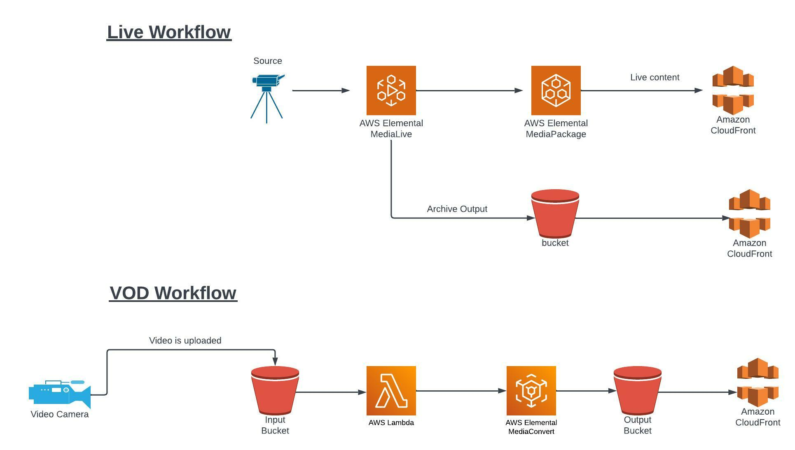
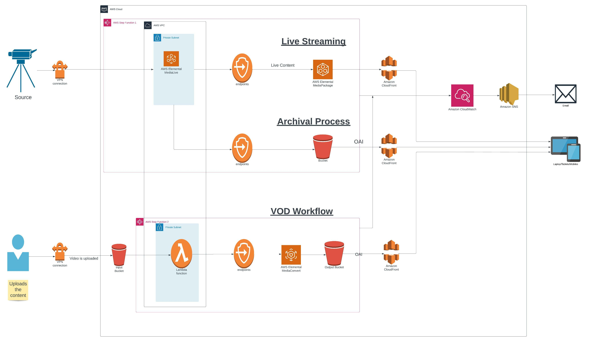
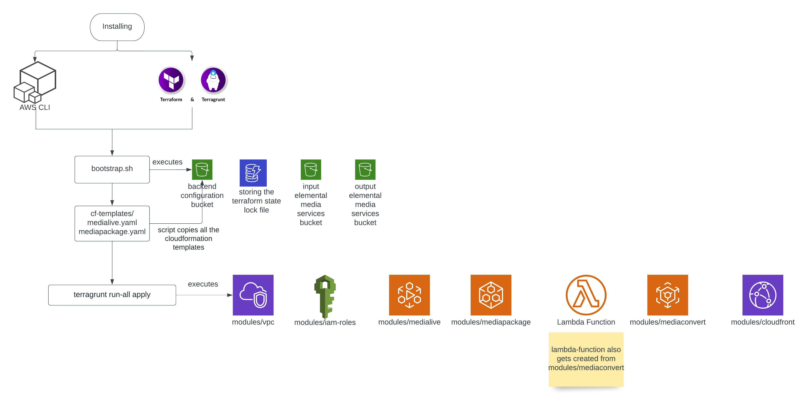

# APES
AWS pipeline for elemental services

**For detailed documentation of the process please look into** [Docs](./Docs/Process%20documentation.docx)

## Introduction
**AWS Pipeline For Elemental Services** is an internal DevOps accelerator in Media domain. Our goal is to develop an Infra-as-a-Code pipeline for launching a full working AWS Elemental streaming infrastructure for livestreaming and Video-on-Demand service.

In order to reach to our  goal, we have developed a pure GitOps based pipeline operated entirely out of GitHub making use of GitHub actions and Terraform.

## Architecture



## APES Architecture in Production



## Technical Overview
This is a pure [GitOps](https://about.gitlab.com/topics/gitops/) based pipeline operated entirely out of github making use of github actions and terraform. In addition, we use 
- **terragrunt** on top of terraform to keep the code [DRY](https://terragrunt.gruntwork.io/docs/features/keep-your-terraform-code-dry/).
- **cloudformation** because not all media services are fully supported by terraform as of now.

We start by bootstrapping the required resources to maintain the terraform backend and to upload/update cloudformation templates in the s3 bucket.
Then we go ahead by installing terragrunt and running plan and apply separately.

## Workflow



## Techn Stack in APES
Developed AWS Elemental Services mostly using Terraform as IAC ; Python and Shell Scripting for VOD (Video-on-Demand) and Live Streaming.

**Shell-Scripting**:
- Shell scripts have been written in the apes/bootstrap.sh which executes:
  - Backend S3 bucket
  - DynamoDB table
  - Input S3 bucket
  - Output S3 bucket.
- Shell scripting has been chosen over Terraform for these services since they are pre-requisites, to initiate the terraform infra pipeline we need these resources beforehand which obviously cannot be created by terraform, thus we preferred shell scripting for a seamless workflow for these services.

**Python**:
- Code has been written in Python for MediaConvert, as aws CloudFormation does not support the mediaconvert job.

**CloudFormation**:
- The Mediapackage and the Medialive CloudFormation templates are written in yaml file as all the elemental media services are not completely supported by terraform.
- These cf-templates will be stored in the backend S3 bucket.

**Terraform for Infrastructure as code (IAC)**:
Terraform is an infrastructure as code (IaC) tool that allows you to build, change, and version infrastructure safely and efficiently.

**Terragrunt**:
Terragrunt is a thin wrapper for Terraform that provides extra tools for keeping your Terraform configurations DRY, working with multiple Terraform modules, and managing remote state.
- Run terragrunt run-all which executes:
  - VPC services like vpc, subnets (public & private), internet-gateway, nat-gateway, route-tables (public & private) and the security groups
  - IAM roles and attached policies
  - Cloudfront Distribution.
  - MediaLive Channel
  - MediaPackage Channel
  - MediaConvert (written in python)
  - Lambda function

## Bootstrapping 
The script ```bootstrap.sh``` is responsible for launching the required infra components for the terraform pipeline. These components are an s3 bucket and a dynamodb table for maintaining lock and terraform remote state. The bootstrap script, written in bash does the following:
- Checks first whether the s3 bucket and dynamodb table with the same name exist or not
- If these exist then it doesn't create them. We call this s3 bucket as backend bucket.
- The script also checks for another s3 bucket that will be used for media files and creates if the bucket doesn't exist. We call this elemental bucket
- After that the script copies all the cloudformation templates from ```cf-templates``` folder to elemental s3 bucket.  

## Terragrunt Plan and Apply
We run terragrunt plan and then terragrunt apply :

**How do we call the API?** - We do the calling of the API, fetching of the endpoint and replacing the url in terraform tfvars through a script 
>```update-url.sh```.

## Sequence of steps for manual execution through local system

- Verify the values of terraform backend bucket in the root ```terragrunt.hcl``` , ```terraform.tfvars``` and ```bootstrap.sh```
> - Run ```./bootstrap.sh``` on linux OR on gitbash running on windows
> - Run ```./update-url.sh``` on linux OR on gitbash running on windows
> - Run ```terragrunt run-all plan```
> - Run ```terragrunt run-all apply --terragrunt-non-interactive```

*to apply all of your new modules/changes*

you can add your variables values in tfvars file and make sure **not to commit any credentials here**

## To Do